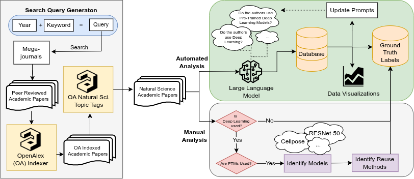

<!-- prettier-ignore -->
<div align="center">

# AIUS

_A CLI for studying deep learning and pre-trained model reuse in natural science publications_

[](LICENSE)


[About](#about) • [Requirements](#requirements) • [Install](#install) • [Run The CLI](#run-the-cli) • [Results](#results) • [Data](#data-and-reproducibility) • [Contributing](#contributing) • [Citation](#citation)



</div>

## About

AIUS is the codebase behind *An Exploratory Mixed-Methods Study of Deep Neural Network Reuse in Computational Natural Science*. It provides a CLI for building the study database, collecting OpenAlex metadata, downloading JATS XML, converting articles to Markdown, and running LLM-based analysis over the resulting corpus.

As the diagram above shows, the study pairs automated LLM analysis with manual analysis to produce ground truth labels about model reuse.

What this repository contains:

- The `aius` Python package and CLI entrypoint.
- Runners for the study pipeline: `init`, `search`, `openalex`, `jats`, `pandoc`, and `analyze`.
- Analysis, plotting, and historical scripts under `scripts/`, `figures/`, and `statistics/`.
- The code used to reproduce the study workflow; release data is distributed separately through Zenodo.

<details>
<summary>IEEE eScience 2026 Short Paper Presentationresentation</summary>

[](https://www.youtube.com/watch?v=pD_0LaN38IA)

</details>

## Requirements

- Python 3.13
- `uv`
- `make`
- A local `pandoc` service for the `pandoc` step
- An OpenAlex email address for polite-pool access
- An LLM backend for `analyze` (`ollama`, `metis`, `openai`, `openai-batch`, or `sophia`)
- The PLOS archive path if you need a non-default JATS source archive

## Install

Create a full development environment:

```bash
make create-dev
```

That installs pre-commit hooks, refreshes hook versions, removes the local `env/` directory if present, and syncs dependencies with `uv`.

To build the package artifacts:

```bash
make build
```

## Run The CLI

The CLI entrypoint is `aius`. By default it uses `aius.sqlite3` in the current working directory.

Check the available commands:

```bash
aius --help
aius <subcommand> --help
```

Typical pipeline:

```bash
aius init
aius search --megajournal plos
aius openalex --email you@example.com
aius jats --megajournal plos
aius pandoc
aius analyze --backend ollama --model-name llama3.1 --system-prompt-id uses_dl
```

> [!WARNING]
> `init` is not idempotent — re-running it against an existing database fails
> with a UNIQUE-constraint error. Start from a fresh database.

Notes:

- `init` seeds the SQLite database and creates the tables and views.
- `search` and `jats` accept `--megajournal` values from `bmj`, `f1000`, `frontiersin`, and `plos`.
- `openalex` requires `--email`.
- `analyze` requires `--backend` and `--model-name`; it also accepts `--system-prompt-id` values such as `uses_dl`, `uses_ptms`, `identify_ptms`, `identify_ptm_reuse`, and `identify_ptm_impact`. Backends other than `ollama` also require `--auth-key`.
- `pandoc` defaults to `http://localhost:3030`.
- `jats` defaults to `allofplos.zip` in the repository root.

## Results

`analyze` does not write to the database. Each run writes one parquet file to the current working directory, named `aius_<backend>_<prompt>_index-<i>_stride-<s>.parquet`.

The `--index` and `--stride` options shard the document list, so parallel workers can split a corpus and write one parquet per shard.

Load parquet files into the database with:

```bash
python scripts/data_loading/load_parquet_2_db.py --parquet-dir <dir> --db-path <db> --db-table <table>
```

The `openai-batch` backend is the exception: it uploads JSONL shards instead of writing parquet files, and its results are converted with `scripts/data_loading/jsonl_2_parquet.py`.

## Data And Reproducibility

The study data and supporting artifacts are released separately through Zenodo. The repository keeps the code, while the database and other study outputs are intended to be reused from the archived release.

OpenAlex responses are stored in the SQLite database so later steps can reuse the captured metadata instead of depending on changing upstream results.

## Contributing

Use the development environment above and run the pre-commit hooks locally before sending changes. The repository is configured to format and lint through pre-commit, so that is the best first check.

Please keep changes aligned with the existing CLI runner flow and avoid committing secrets or API keys.

## License

Licensed under the [GNU Affero General Public License v3.0](LICENSE).

## Citation

To cite this work, please use one of the following BibTex citations:

**arXiv Preprint**

```bibtex
@misc{synovic2026empiricalinvestigationpretraineddeep,
      title={An Empirical Investigation of Pre-Trained Deep Learning Model Reuse in the Scientific Process},
      author={Nicholas M. Synovic and Karolina Ryzka and Alessandra V. Vellucci Solari and Kenny Lyons and James C. Davis and George K. Thiruvathukal},
      year={2026},
      eprint={2603.13584},
      archivePrefix={arXiv},
      primaryClass={cs.SE},
      url={https://arxiv.org/abs/2603.13584},
}
```

**Zenodo Data**

```bibtex
@software{synovic_2026_21874098,
  author       = {Synovic, Nicholas and
                  Ryzka, Karolina and
                  Vellucci Solari, Alessandra Valentina and
                  Lyons, Kenny and
                  Davis, James C. and
                  Thiruvathukal, George K.},
  title        = {An Empirical Investigation of Pre-Trained Deep
                   Learning Model Reuse in the Scientific Process
                   Artifact
                  },
  month        = aug,
  year         = 2026,
  publisher    = {Zenodo},
  doi          = {10.5281/zenodo.21874098},
  url          = {https://doi.org/10.5281/zenodo.21874098},
}
```


**FigShare Presentation**

```bibtex
@article{Synovic2026,
author = "Nicholas Synovic and Karolina Ryzka and Alessandra Vellucci Solari and Kenny Lyons and James C. Davis and George K. Thiruvathukal",
title = "{An Empirical Investigation of Pre-Trained Deep Learning Model Reuse in the Scientific Process}",
year = "2026",
month = "9",
url = "https://figshare.com/articles/presentation/An_Empirical_Investigation_of_Pre-Trained_Deep_Learning_Model_Reuse_in_the_Scientific_Process/34018209",
doi = "10.6084/m9.figshare.34018209.v1"
}
```
